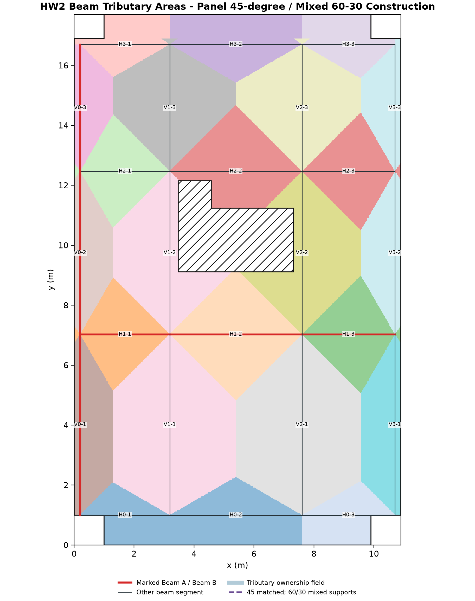
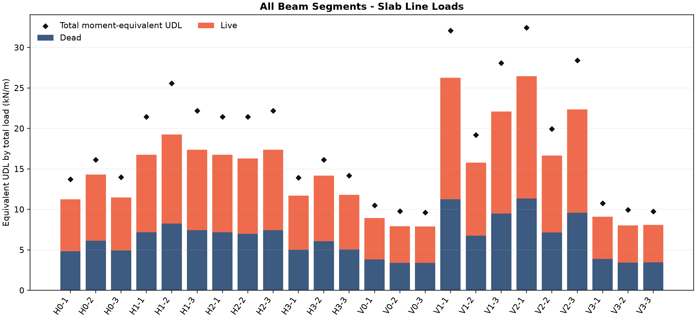
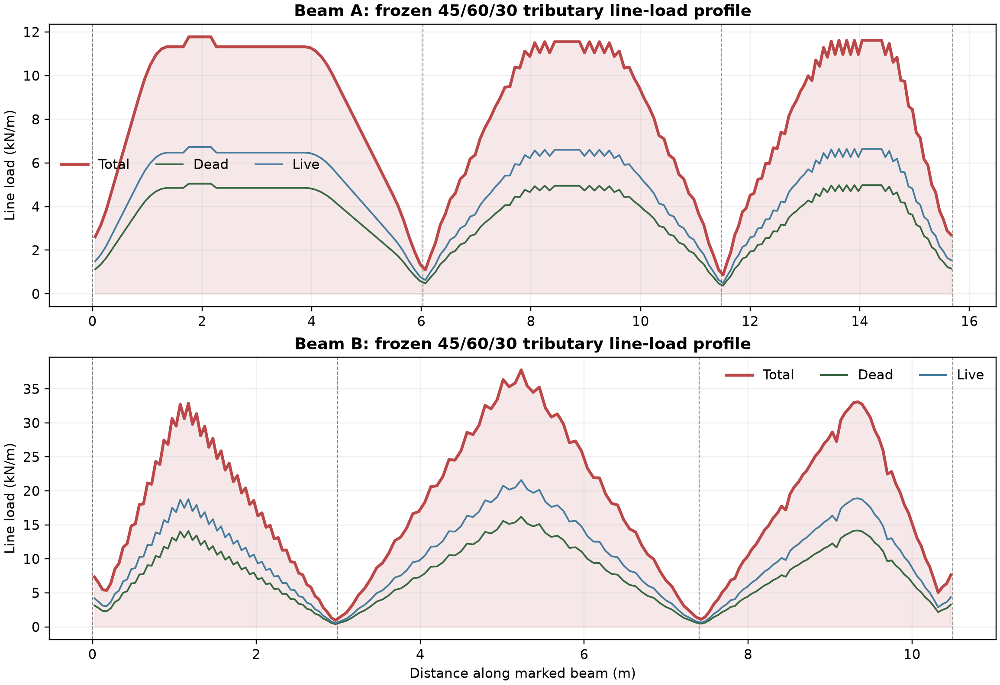
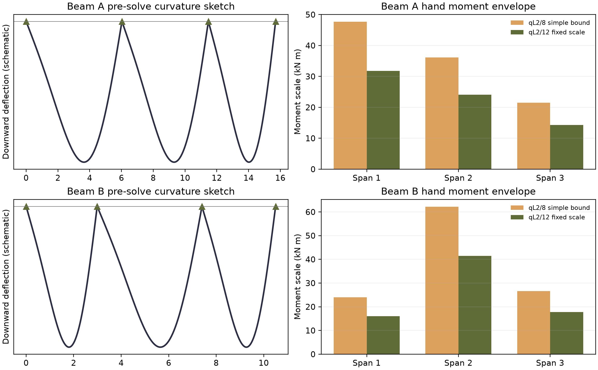
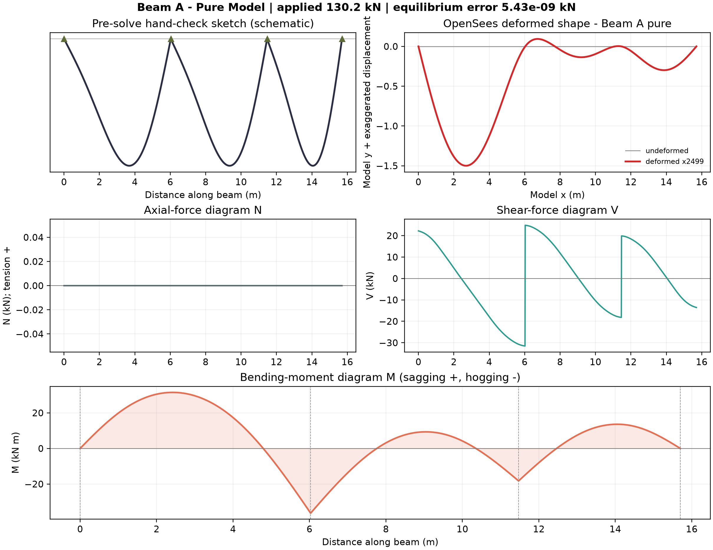
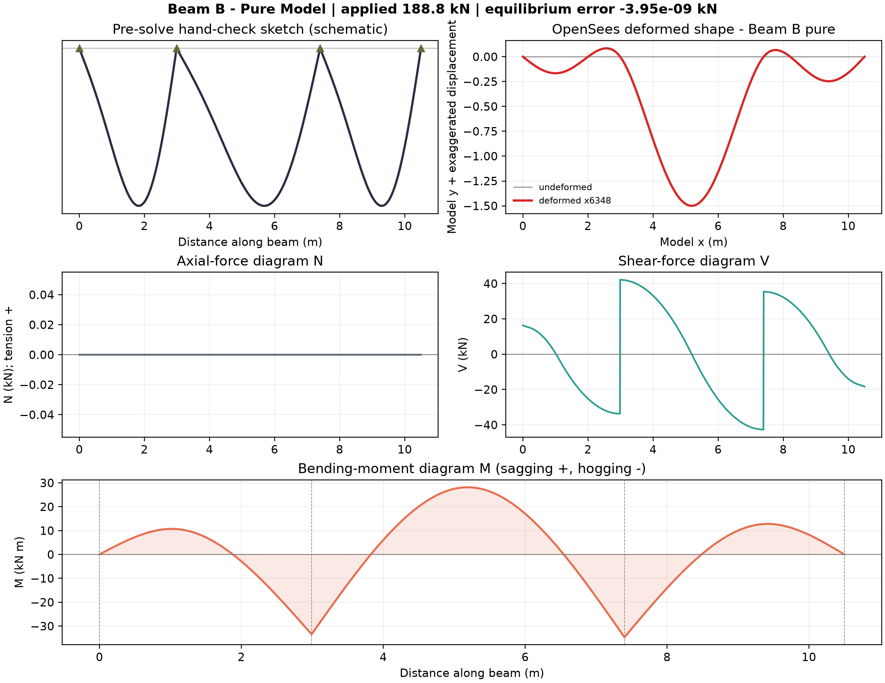
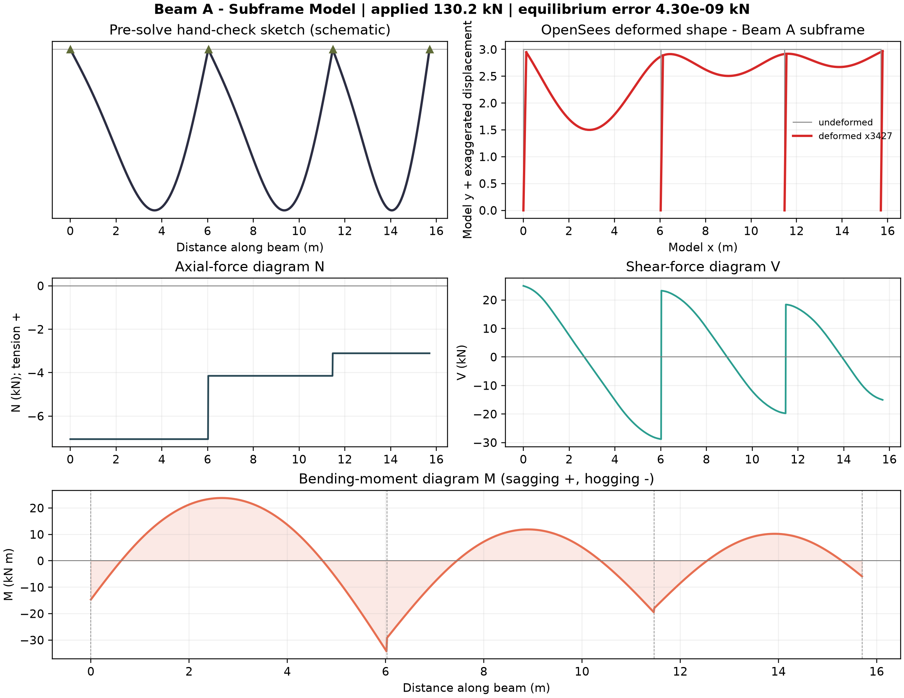
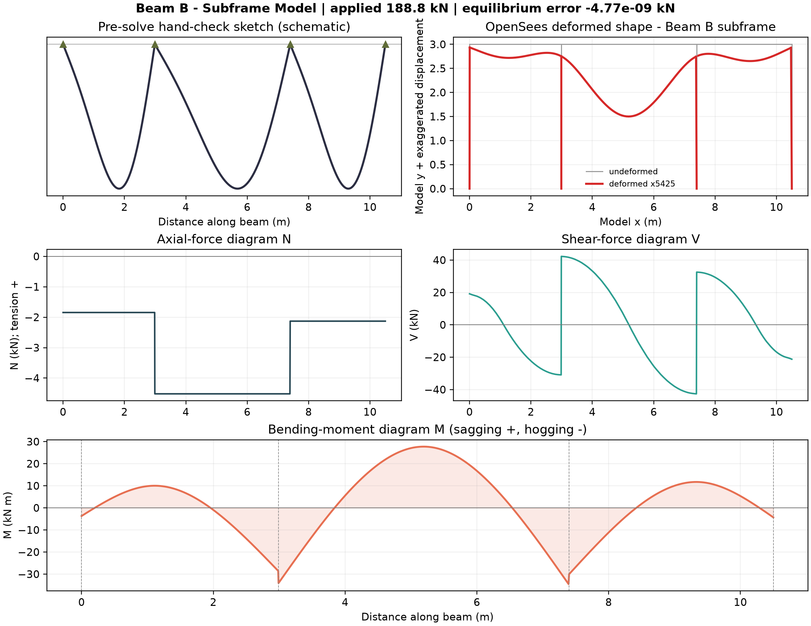
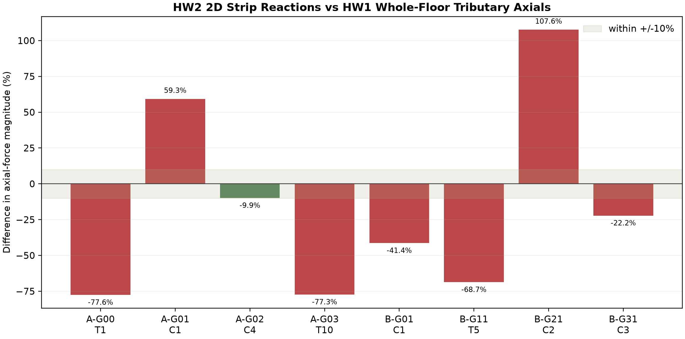

# Homework 2: From Slab to Beam - Tributary Areas, Line Loads and a Two-Dimensional Subframe

**Course:** Computer (& AI) Methods for Structural Engineering (DISC 5203)<br>
**Student:** Shuhan He / 何抒翰<br>
**Student ID:** 21345221<br>
**Assigned input:** Floor Plan 1 (student-ID final digit = 1)<br>
**Prepared for review:** 7 October 2026<br>
**Repository state:** cumulative course repository extended directly from the accepted HW1 Git state; HW1 remains separately reviewable under `HW1/` and this work is under `HW2/`

## 1. Executive summary

This report extends the accepted HW1 geometry rather than re-deriving it. The same **180.128 m²** net slab is read horizontally onto 24 finite beam segments. Each panel is classified before load allocation: matched supports divide at 45 degrees, while a continuous/fixed edge paired with a discontinuous/simple edge divides at 60 degrees from the continuous edge and 30 degrees from the discontinuous edge. The beam tributary areas close to the HW1 net slab area within numerical precision. Dead and live slab loads are stored separately as non-uniform profiles; the table distinguishes total-load-equivalent and midspan-moment-equivalent UDLs.

Student ID 21345221 selects Floor Plan 1. The marked vertical member is **Beam A**, the left perimeter beam with slab primarily on one side. The marked horizontal member is **Beam B**, the continuous beam on the C1-C2-C3 line with slab on both sides. Four OpenSees analyses were completed: a standalone continuous beam and a one-floor beam-column subframe for each marked beam. All four close vertical equilibrium to less than 1e-8 kN and pass the pre-solve sign and magnitude checks.

The HW2 subframe-versus-HW1 axial comparison gives the same compression sign at every mapped support, but not a close magnitude match. This is reported as a diagnostic result, not hidden: the 2D marked strip contains only the load delivered to that beam line, whereas HW1 assigns the whole floor directly to its nearest column/wall, including orthogonal load paths and wall aggregation. Exact reconciliation would require a full 3D floor-grid model or a common support-aggregation rule.

## 2. Reused input, assumptions and marked beams


The HW1 local datum, slab outline, additions, openings, column locations and wall locations are reused unchanged from `../HW1/config/plan1_geometry.json`. The new beam grid uses x = 0.20, 3.19, 7.60 and 10.70 m and y = 1.00, 7.03, 12.47 and 16.70 m. Segment endpoints are grid intersections; therefore reported spans are centreline distances.

Load and modelling assumptions:

- slab thickness `h = 0.150 m`;
- concrete unit weight `gamma = 25.0 kN/m³`;
- slab dead load `n_D = gamma h = 3.75 kN/m²`;
- live load `n_L = 5.00 kN/m²`;
- no superimposed finish is added because Floor Plan 1 gives none;
- beam self-weight is excluded so that both models compare the same slab-to-beam transfer requested by HW2;
- beam size is not printed on the plan, so both model types use an explicit common assumption of 300 x 600 mm;
- columns are 400 x 400 mm, storey height is 3.0 m, and `E = 30.0 GPa = 30.0e6 kN/m²`;
- service loads are unfactored. Units in OpenSees are kN and m, so second moments of area are in m4.

## 3. Beam tributary-area methodology

The net HW1 slab polygon is discretised into 0.02 m cells and treated panel by panel. Exterior main-slab edges are classified as discontinuous/simple; shared interior grid edges are continuous/fixed. A cell is assigned to the edge with the smallest weighted distance `d/w`, using `w = 1` for a discontinuous edge and `w = sqrt(3)` for a continuous edge. Matched supports have equal weights and retain the 45-degree bisector. At a mixed corner, `d_cont/sqrt(3) = d_disc`, so the boundary leaves the continuous edge at 60 degrees and the discontinuous edge at 30 degrees. This gives the continuous edge the larger tributary share required by the deck.

For an ideal rectangular two-way panel with matched supports, the 45-degree construction gives each short edge a triangular area

`A_short = a²/4`,

and each long edge a trapezoidal area

`A_long = ab/2 - a²/4 = a(2b-a)/4`.

The same weighted rule is applied to the actual net polygon rather than idealised full rectangles, so the stair/core openings remove load before assignment. P10 and P11 are one-edge cantilever balcony slabs; all their load goes to H0/H3 and their free edges are not treated as supports. This explicitly avoids the two assignment traps: beta-vx/beta-vy is not interchanged, and a free edge is not entered into a four-edge table. The area route is the governing calculation; any coefficient-table check must use the short span and the coefficient for the correct edge orientation.



Verification:

- beam count: **24**;
- sum of exact beam tributary areas: **180.128500 m²**;
- reused HW1 net slab area: **180.128500 m²**;
- global dead/live loads: **675.482 / 900.642 kN**.

## 4. Beam census

`Depth = 0.600 assumed` is deliberately labelled wherever the drawing gives no beam depth.

| ID | Start (m) | End (m) | Span (m) | Depth (m) | Bordering panel(s) | Class |
|---|---|---|---|---|---|---|
| H0-1 | (0.20,1.00) | (3.19,1.00) | 2.990 | 0.600 assumed | P1; P10 (cantilever balcony where overlapping) | two loaded sides locally (main slab + balcony) |
| H0-2 | (3.19,1.00) | (7.60,1.00) | 4.410 | 0.600 assumed | P2; P10 (cantilever balcony where overlapping) | two loaded sides locally (main slab + balcony) |
| H0-3 | (7.60,1.00) | (10.70,1.00) | 3.100 | 0.600 assumed | P3; P10 (cantilever balcony where overlapping) | two loaded sides locally (main slab + balcony) |
| H1-1 | (0.20,7.03) | (3.19,7.03) | 2.990 | 0.600 assumed | P1; P4 | interior, slab on both sides |
| H1-2 | (3.19,7.03) | (7.60,7.03) | 4.410 | 0.600 assumed | P2; P5 | interior, slab on both sides |
| H1-3 | (7.60,7.03) | (10.70,7.03) | 3.100 | 0.600 assumed | P3; P6 | interior, slab on both sides |
| H2-1 | (0.20,12.47) | (3.19,12.47) | 2.990 | 0.600 assumed | P4; P7 | interior, slab on both sides |
| H2-2 | (3.19,12.47) | (7.60,12.47) | 4.410 | 0.600 assumed | P5; P8 | interior, slab on both sides |
| H2-3 | (7.60,12.47) | (10.70,12.47) | 3.100 | 0.600 assumed | P6; P9 | interior, slab on both sides |
| H3-1 | (0.20,16.70) | (3.19,16.70) | 2.990 | 0.600 assumed | P7; P11 (cantilever balcony where overlapping) | two loaded sides locally (main slab + balcony) |
| H3-2 | (3.19,16.70) | (7.60,16.70) | 4.410 | 0.600 assumed | P8; P11 (cantilever balcony where overlapping) | two loaded sides locally (main slab + balcony) |
| H3-3 | (7.60,16.70) | (10.70,16.70) | 3.100 | 0.600 assumed | P9; P11 (cantilever balcony where overlapping) | two loaded sides locally (main slab + balcony) |
| V0-1 | (0.20,1.00) | (0.20,7.03) | 6.030 | 0.600 assumed | P1 | perimeter, slab on one side |
| V0-2 | (0.20,7.03) | (0.20,12.47) | 5.440 | 0.600 assumed | P4 | perimeter, slab on one side |
| V0-3 | (0.20,12.47) | (0.20,16.70) | 4.230 | 0.600 assumed | P7 | perimeter, slab on one side |
| V1-1 | (3.19,1.00) | (3.19,7.03) | 6.030 | 0.600 assumed | P1; P2 | interior, slab on both sides |
| V1-2 | (3.19,7.03) | (3.19,12.47) | 5.440 | 0.600 assumed | P4; P5 | interior, slab on both sides |
| V1-3 | (3.19,12.47) | (3.19,16.70) | 4.230 | 0.600 assumed | P7; P8 | interior, slab on both sides |
| V2-1 | (7.60,1.00) | (7.60,7.03) | 6.030 | 0.600 assumed | P2; P3 | interior, slab on both sides |
| V2-2 | (7.60,7.03) | (7.60,12.47) | 5.440 | 0.600 assumed | P5; P6 | interior, slab on both sides |
| V2-3 | (7.60,12.47) | (7.60,16.70) | 4.230 | 0.600 assumed | P8; P9 | interior, slab on both sides |
| V3-1 | (10.70,1.00) | (10.70,7.03) | 6.030 | 0.600 assumed | P3 | perimeter, slab on one side |
| V3-2 | (10.70,7.03) | (10.70,12.47) | 5.440 | 0.600 assumed | P6 | perimeter, slab on one side |
| V3-3 | (10.70,12.47) | (10.70,16.70) | 4.230 | 0.600 assumed | P9 | perimeter, slab on one side |

## 5. Line load on every beam

For beam segment `i`, the exact integrated loads are `D_i = n_D A_i` and `L_i = n_L A_i`. The equivalent UDL values in the table are

`w_D,eq = D_i/L_i,beam`, `w_L,eq = L_i/L_i,beam`, and `w_eq = w_D,eq + w_L,eq`.

The load-equivalent values preserve **total load only**. For the required moment equivalent, the simply-supported midspan influence line is `m(s) = s/2` for `s <= L/2` and `m(s) = (L-s)/2` for `s > L/2`. Thus `M_mid = integral w(s)m(s) ds` and `w_M,eq = 8 M_mid/L²`. Neither UDL replaces the local polygonal profile in OpenSees; the frozen profile is applied piecewise so local shear and moment shape are retained.

| ID | Span | Area | Mean width | Shape | Dead load-eq | Live load-eq | Total load-eq | Total moment-eq |
|---|---|---|---|---|---|---|---|---|
| H0-1 | 2.990 | 3.846 | 1.286 | 45/60/30 panel polygon + balcony cantilever UDL | 4.824 | 6.432 | 11.255 | 13.712 |
| H0-2 | 4.410 | 7.205 | 1.634 | 45/60/30 panel polygon + balcony cantilever UDL | 6.127 | 8.169 | 14.295 | 16.146 |
| H0-3 | 3.100 | 4.069 | 1.313 | 45/60/30 panel polygon + balcony cantilever UDL | 4.922 | 6.563 | 11.485 | 13.995 |
| H1-1 | 2.990 | 5.723 | 1.914 | two-sided superposed 45/60/30 polygons | 7.177 | 9.570 | 16.747 | 21.445 |
| H1-2 | 4.410 | 9.707 | 2.201 | two-sided superposed 45/60/30 polygons | 8.254 | 11.005 | 19.259 | 25.585 |
| H1-3 | 3.100 | 6.148 | 1.983 | two-sided superposed 45/60/30 polygons | 7.437 | 9.915 | 17.352 | 22.194 |
| H2-1 | 2.990 | 5.723 | 1.914 | two-sided superposed 45/60/30 polygons | 7.177 | 9.570 | 16.747 | 21.445 |
| H2-2 | 4.410 | 8.220 | 1.864 | two-sided superposed 45/60/30 polygons | 6.990 | 9.319 | 16.309 | 21.440 |
| H2-3 | 3.100 | 6.148 | 1.983 | two-sided superposed 45/60/30 polygons | 7.437 | 9.915 | 17.352 | 22.194 |
| H3-1 | 2.990 | 4.000 | 1.338 | 45/60/30 panel polygon + balcony cantilever UDL | 5.016 | 6.688 | 11.705 | 13.904 |
| H3-2 | 4.410 | 7.150 | 1.621 | 45/60/30 panel polygon + balcony cantilever UDL | 6.080 | 8.107 | 14.187 | 16.137 |
| H3-3 | 3.100 | 4.184 | 1.350 | 45/60/30 panel polygon + balcony cantilever UDL | 5.062 | 6.749 | 11.811 | 14.182 |
| V0-1 | 6.030 | 6.145 | 1.019 | one-sided mixed-support 45/60/30 polygon | 3.822 | 5.095 | 8.917 | 10.492 |
| V0-2 | 5.440 | 4.918 | 0.904 | one-sided mixed-support 45/60/30 polygon | 3.390 | 4.520 | 7.911 | 9.777 |
| V0-3 | 4.230 | 3.822 | 0.903 | one-sided mixed-support 45/60/30 polygon | 3.388 | 4.517 | 7.906 | 9.616 |
| V1-1 | 6.030 | 18.090 | 3.000 | two-sided superposed 45/60/30 polygons | 11.250 | 15.000 | 26.250 | 32.089 |
| V1-2 | 5.440 | 9.803 | 1.802 | two-sided superposed 45/60/30 polygons | 6.758 | 9.010 | 15.768 | 19.199 |
| V1-3 | 4.230 | 10.687 | 2.526 | two-sided superposed 45/60/30 polygons | 9.474 | 12.632 | 22.106 | 28.069 |
| V2-1 | 6.030 | 18.233 | 3.024 | two-sided superposed 45/60/30 polygons | 11.339 | 15.119 | 26.458 | 32.437 |
| V2-2 | 5.440 | 10.352 | 1.903 | two-sided superposed 45/60/30 polygons | 7.136 | 9.515 | 16.651 | 19.956 |
| V2-3 | 4.230 | 10.804 | 2.554 | two-sided superposed 45/60/30 polygons | 9.578 | 12.771 | 22.349 | 28.400 |
| V3-1 | 6.030 | 6.264 | 1.039 | one-sided mixed-support 45/60/30 polygon | 3.895 | 5.194 | 9.089 | 10.744 |
| V3-2 | 5.440 | 4.981 | 0.916 | one-sided mixed-support 45/60/30 polygon | 3.433 | 4.578 | 8.011 | 9.948 |
| V3-3 | 4.230 | 3.908 | 0.924 | one-sided mixed-support 45/60/30 polygon | 3.465 | 4.620 | 8.084 | 9.757 |

Units: span and mean width in m; area in m²; equivalent line loads in kN/m.



### 5.1 Worked example - H1-2 (central segment of Beam B)

H1-2 runs from (3.19,7.03) to (7.60,7.03), so `L = 4.410 m`. It borders P2 and P5 and is an interior, two-sided segment. The panel-by-panel 45/60/30 allocation, after removing the core opening, is `A_t = 9.707 m²`, giving

`D = 3.75 x 9.707 = 36.401 kN`,

`L_live = 5.00 x 9.707 = 48.535 kN`,

`w_D,eq = D/4.410 = 8.254 kN/m`,

`w_L,eq = L_live/4.410 = 11.005 kN/m`,

`w_total,eq = 19.259 kN/m`.

For the moment equivalent, `M_mid = w_M,eq L²/8 = 62.197 kN m`, so

`w_M,eq = 25.585 kN/m`.

The plotted profile is the sum of the P2 and P5 polygonal contributions after the opening is removed. The load-equivalent UDL checks total load; the moment-equivalent UDL sets the hand bound; the exact profile is used by OpenSees.



## 6. Pre-solve hand bounds and expected shapes

Before OpenSees was run, each span was bounded by `w_M,eq L²/8` for a simple span, with `w_M,eq L²/12` used as a fixed-end/continuous scale. The standalone and subframe beams were expected to show positive sagging at span centres, negative hogging over internal supports, zero or small end moments depending on support idealisation, and inflection points between the positive and negative regions. Beam B's middle span was expected to dominate because it is both the longest horizontal span and receives load from two sides.



The largest simple-span bounds are 47.687 kN m for Beam A and 62.198 kN m for Beam B. The solver peaks remain below 1.5 times these conservative order-of-magnitude bounds and have the expected signs.

## 7. OpenSees Model A - standalone continuous beams

The plain-language briefings are stored before the generated files in `briefings/beam_A.md` and `briefings/beam_B.md`. Each standalone model uses shared nodes through three spans, one horizontal restraint at the first support, vertical restraints at all supports, free rotations, elasticBeamColumn elements, and the frozen downward local-y piecewise line load. Sixty elements per grid segment reproduce the stored load profile without replacing it by the tabulated UDL.





## 8. OpenSees Model B - one-floor subframes

For each marked beam, the point supports are replaced by 3.0 m high 400 x 400 mm elastic columns with fixed bases. Beam and column elements share the same floor node, allowing finite support rotation and frame action. The same beam geometry, material, section and frozen load profile are retained, so differences from the standalone case are caused by support stiffness and continuity rather than changed loading.





The subframe curves remain smooth through the support nodes; there is no displacement kink caused by duplicate or disconnected nodes. The columns sway/rotate with the floor line as one connected frame. Small beam axial forces appear only in the subframe because column bending couples horizontal translation and joint rotation into the beam.

## 9. Numerical model results and comparison

| Beam | Model | Load | Max sagging | Max hogging | Max |M| | Max down (mm) | Largest qL2/8 | Verdict |
|---|---|---|---|---|---|---|---|---|
| A | pure | 130.245 | 31.504 | -36.371 | 36.371 | 0.6002 | 47.687 | PASS |
| A | subframe | 130.245 | 23.786 | -34.246 | 34.246 | 0.4377 | 47.687 | PASS |
| B | pure | 188.798 | 28.144 | -34.678 | 34.678 | 0.2363 | 62.198 | PASS |
| B | subframe | 188.798 | 27.732 | -34.523 | 34.523 | 0.2765 | 62.198 | PASS |

Units: load in kN; moments in kN m.

For Beam A, finite column stiffness changes the maximum absolute moment from 36.371 to 34.246 kN m and the maximum downward deflection from 0.6002 to 0.4377 mm. The subframe introduces beam axial compression and non-zero end moments because the column joints are neither perfect pins nor ideal vertical rollers. For Beam B, the pure/subframe peak absolute moments are 34.678 / 34.523 kN m; the subframe develops end moment and axial compression and redistributes the sagging peak. The small deflections follow from the assumed uncracked 300 x 600 mm elastic section; they should not be read as cracked-service deflections.

The **subframe is the more defensible model for beam design actions** because it represents finite column stiffness and joint continuity. The standalone beam is still valuable as an independent bound and debugging model. It answers a deliberately simplified support question rather than the full frame-interaction question.

## 10. Subframe support reactions and HW1 axial cross-check

Compression is reported as negative in both columns. Percentage difference is `(abs(N_HW2)-abs(N_HW1))/abs(N_HW1) x 100%`.

| Strip | Grid | HW1 element | HW1 N | HW2 N | Difference % | Sign |
|---|---|---|---|---|---|---|
| A | G00 | T1 | -111.266 | -24.952 | -77.6 | PASS |
| A | G01 | C1 | -32.699 | -52.086 | 59.3 | PASS |
| A | G02 | C4 | -42.360 | -38.178 | -9.9 | PASS |
| A | G03 | T10 | -66.258 | -15.029 | -77.3 | PASS |
| B | G01 | C1 | -32.699 | -19.153 | -41.4 | PASS |
| B | G11 | T5 | -233.992 | -73.199 | -68.7 | PASS |
| B | G21 | C2 | -36.226 | -75.201 | 107.6 | PASS |
| B | G31 | C3 | -27.321 | -21.246 | -22.2 | PASS |



All eight comparisons have the correct compression sign and the same order of magnitude, but none is within a few percent; therefore this is **not claimed as a close-match positive result**. The dominant reason is model scope. HW1 directly assigns each entire slab cell to its nearest vertical element, including orthogonal load paths and walls represented as aggregated finite segments. Each HW2 model is only one marked 2D strip and applies load to that beam line; it cannot contain all perpendicular beams delivering load to the same column/wall. Some grid points also map to wall junctions rather than one-to-one columns. No load was tuned to improve the comparison.

For the marked beam's own design actions, the HW2 subframe is trusted because it follows the explicit slab-to-beam-to-column path with frame stiffness. HW1 remains the independent whole-floor gravity estimate. A required exact reconciliation should be performed with a 3D floor grid or a common nodal aggregation model; the present discrepancy is retained as a transparent limitation and a useful diagnostic.

## 11. Speech-to-model prompt and iteration record

The agent was given two short structural briefings in words, not scripts. Each states the marked beam path, spans, supports, frozen loads, section, material and required outputs. The agent then transcribed those briefings into:

- `models/beam_A_pure.py` and `models/beam_A_subframe.py`;
- `models/beam_B_pure.py` and `models/beam_B_subframe.py`;
- shared audited implementation in `models/common.py`.

### 11.1 Beam A plain-language briefing

Use the left vertical marked beam from Floor Plan 1. In plan it runs along x = 0.20 m from y = 1.00 m to 16.70 m, with supports at y = 1.00, 7.03, 12.47 and 16.70 m, giving three spans of 6.03, 5.44 and 4.23 m. It is a discontinuous perimeter edge and receives slab load on the inside only. Use the frozen dead and live line-load profiles calculated panel by panel: matched support conditions divide at 45 degrees, while the mixed perimeter-continuous corners divide at 30 degrees from this discontinuous edge and 60 degrees from the opposing continuous edge. Model the beam as 300 mm wide by 600 mm deep normal-weight reinforced concrete with E = 30 GPa. For the standalone model, keep the beam continuous through its intermediate vertical supports; restrain vertical translation at all four supports, restrain horizontal translation at the first support only, and leave rotations free. For the one-floor subframe, put a 3.0 m high 400 mm by 400 mm column under each beam support, fix the column bases, connect beam and columns rigidly at the floor nodes, and apply the same frozen slab line load to the beam. Report the deformed shape, beam N/V/M diagrams, support reactions, equilibrium checks and the peak moment.

Human gate status before solve: plan identity and member path confirmed; load profiles to be frozen from `output/results/hw2_beam_profiles.json`; mapping/sign convention to be checked against the hand bound before acceptance.

### 11.2 Beam B plain-language briefing

Use the horizontal marked beam on the C1-C2-C3 line of Floor Plan 1. In plan it runs along y = 7.03 m from x = 0.20 m to 10.70 m, with supports at x = 0.20, 3.19, 7.60 and 10.70 m, giving three spans of 2.99, 4.41 and 3.10 m. It is an interior continuous beam and receives slab load from panels on both sides. Use the frozen dead and live line-load profiles calculated panel by panel: matched edge conditions divide at 45 degrees and mixed continuous/discontinuous corners divide at 60/30 degrees. Model the beam as 300 mm wide by 600 mm deep normal-weight reinforced concrete with E = 30 GPa. For the standalone model, keep the beam continuous through its intermediate supports; restrain vertical translation at all four supports, restrain horizontal translation at the first support only, and leave rotations free. For the one-floor subframe, put a 3.0 m high 400 mm by 400 mm column under each support, fix the column bases, connect beam and columns rigidly at the floor nodes, and apply the same frozen slab line load to the beam. Report the deformed shape, beam N/V/M diagrams, support reactions, equilibrium checks and the peak moment.

Human gate status before solve: plan identity and member path confirmed; load profiles to be frozen from `output/results/hw2_beam_profiles.json`; mapping/sign convention to be checked against the hand bound before acceptance.

### 11.3 Iteration and human-gate record

#### Gate 1 - confirm the deck and marked members

- Input: HW2 assignment, `FloorPlan1_HW2.png`, and the existing HW1 metric geometry.
- Decision: student ID 21345221 selects Floor Plan 1.
- Beam A: left vertical perimeter beam, one-sided slab support.
- Beam B: horizontal beam on the C1-C2-C3 line, interior/two-sided slab support.
- Status: confirmed from the red dashed boxes and panel arrangement.

#### Gate 2 - freeze loads before structural analysis

- Dead slab load: 25 kN/m3 x 0.150 m = 3.75 kN/m2.
- Live load: 5.00 kN/m2.
- Superimposed finishes: zero because Floor Plan 1 gives no value.
- Beam self-weight: excluded from the slab-to-beam transfer comparison and stated explicitly.
- Tributary construction: each main-slab panel is classified edge by edge. Matched simple/simple or continuous/continuous corners use 45-degree bisectors; mixed continuous/discontinuous corners use 60 degrees from the continuous edge and 30 degrees from the discontinuous edge. P10 and P11 are one-edge cantilevers and load only H0/H3.
- Frozen machine-readable source: `output/results/hw2_beam_profiles.json`.

#### Gate 3 - first transcription and checks

- Revision 1: transcribed the briefings to continuous standalone beam models using multiple elasticBeamColumn elements and piecewise-uniform loads sampled from the frozen profiles.
- Check: kN-m units, E = 30.0e6 kN/m2, beam I = b d3 / 12 in m4, downward local-y load negative.
- Check: sum of all beam tributary areas equals the reused HW1 net slab area; both load-equivalent and moment-equivalent UDLs are recorded; applied load equals reaction sum in each OpenSees model.

#### Gate 4 - subframe transcription

- Revision 2: replaced vertical point restraints by 3.0 m high elastic columns fixed at their bases, retaining identical beam geometry, section and load profiles.
- Check: floor nodes are shared by beam and column elements, so there are no duplicated/unconnected support nodes.
- Check: zero-continuity comparison is represented by the standalone support idealisation; finite column stiffness is the accepted subframe case. The rigid-support trend is checked against the fixed-end moment scale qL2/12.

#### Gate 5 - human acceptance

- Pre-solve bounds and curvature sketches are generated independently of OpenSees in `output/figures/hw2_04_hand_bounds_and_sketches.png` and the beam-specific comparison figures.
- Automated acceptance requires equilibrium closure, expected sagging/hogging signs, and peak magnitudes within the stated simple/fixed beam envelope.
- Student review/sign-off: pending before Git commit or upload.

The same wording is preserved in `briefings/beam_A.md`, `briefings/beam_B.md` and `briefings/iteration_log.md`.

## 12. Reproducibility, verification and limitations

Run from the repository root:

```powershell
Set-Location HW2
python scripts/analyze_hw2_beam_loads.py
python scripts/run_hw2_models.py
python scripts/summarize_hw2_models.py
python scripts/build_hw2_report.py
python scripts/render_hw2_report_pdf.py
python scripts/verify_hw2_outputs.py
```

Key deterministic checks are exact beam-area closure, global dead/live load conservation, four OpenSees reaction/load closures, expected sagging/hogging signs, pre-solve bound compliance and existence of every deliverable. The method generalises because a different floor plan changes the slab polygon, beam segments and openings in configuration rather than the load-transfer algorithm.

Limitations are explicit: the source plan is raster; unprinted beam dimensions are assumptions; linear uncracked elastic sections do not represent cracked stiffness; and the 2D subframes omit orthogonal frame members. The pre-solve hand-check sketches are independently generated schematics placed beside every solver output. The numerical work and report are complete in the `HW2/` package, while the accepted `HW1/` package remains unchanged and separately reviewable in the same cumulative repository.

## 13. Deliverable index

- report: `report/21345221-report-HW2.md` and `output/pdf/21345221-report-HW2.pdf`;
- beam census and line-load table: `output/results/hw2_beam_line_loads.csv`;
- frozen profiles: `output/results/hw2_beam_profiles.json`;
- four OpenSees inputs: `models/beam_A_pure.py`, `models/beam_A_subframe.py`, `models/beam_B_pure.py`, `models/beam_B_subframe.py`;
- reactions, model summaries and cross-check tables: `output/results/hw2_support_reactions.csv`, `hw2_model_summary.csv`, `hw2_axial_crosscheck.csv`;
- response diagrams and verification figures: `output/figures/hw2_*.png`;
- prompt record: `briefings/`;
- configuration and reusable procedures: `config/hw2_beams.json`, `CLAUDE-HW2.md`, `skills-HW2.md`.
