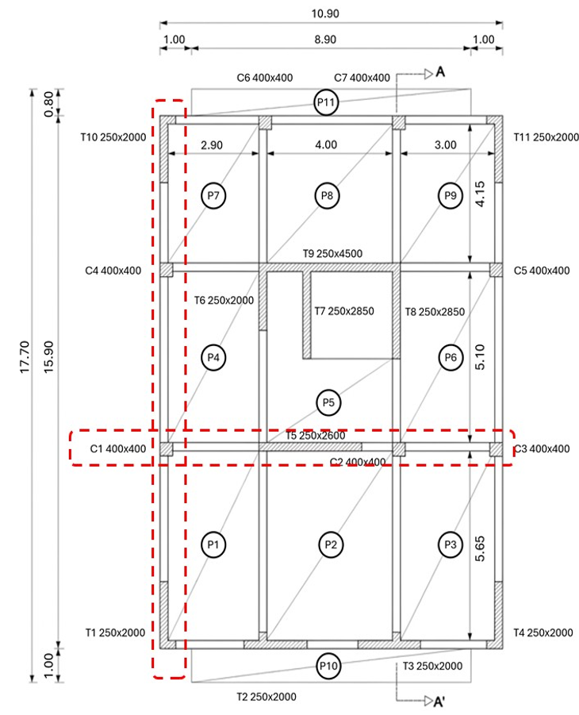
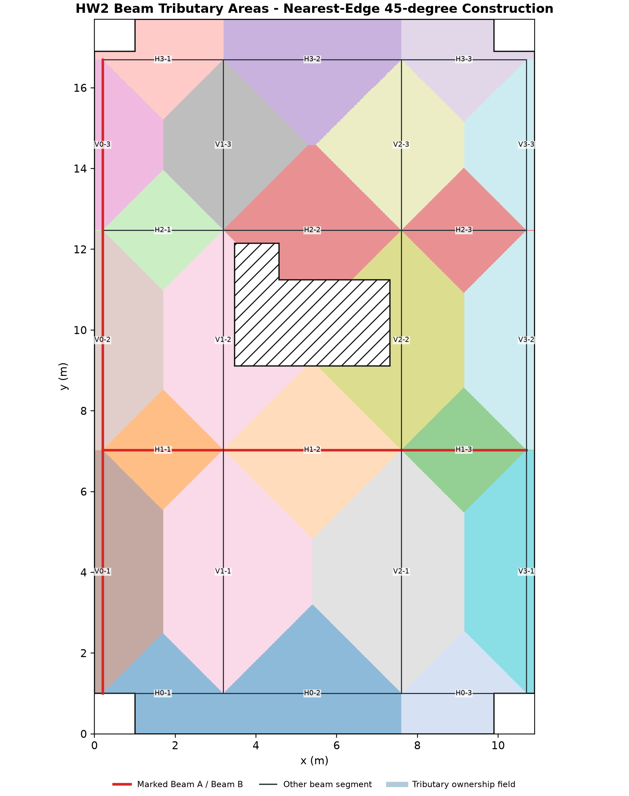
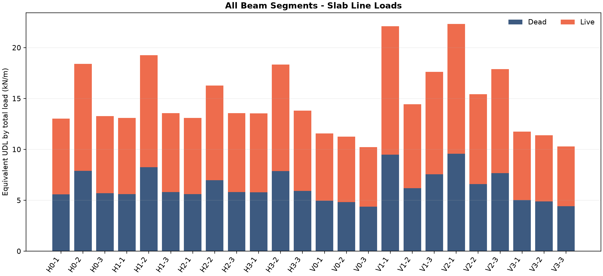
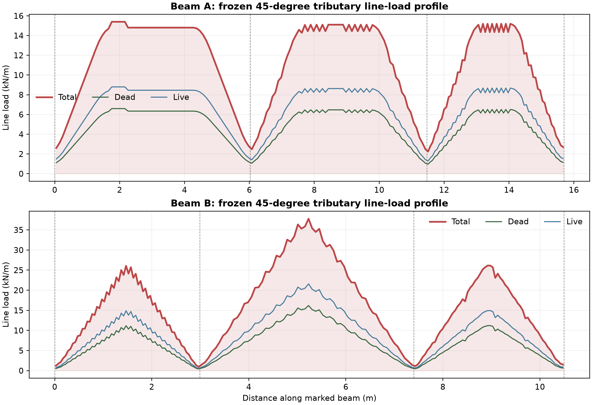
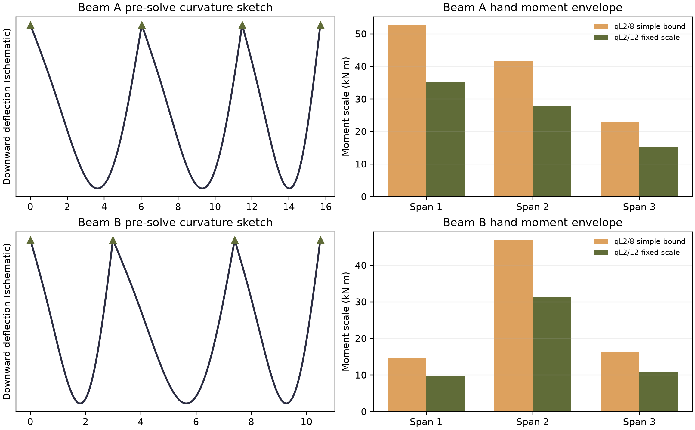
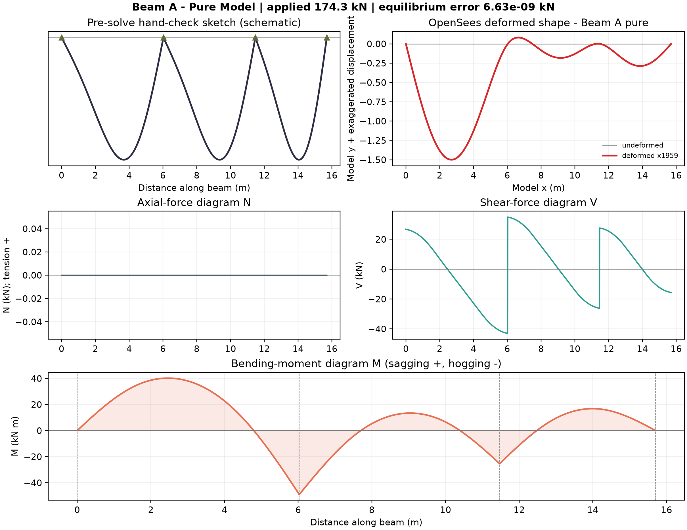
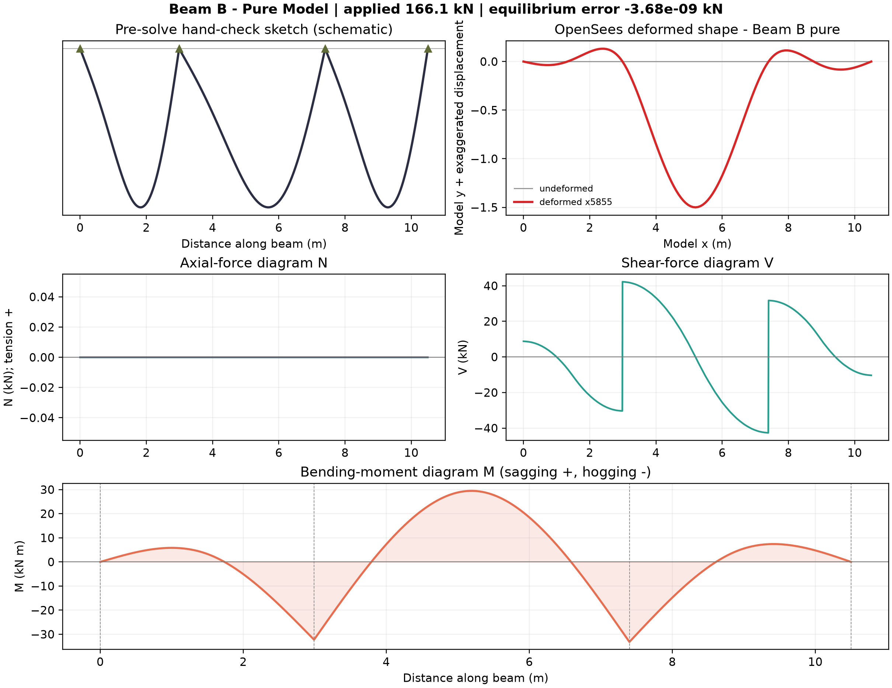
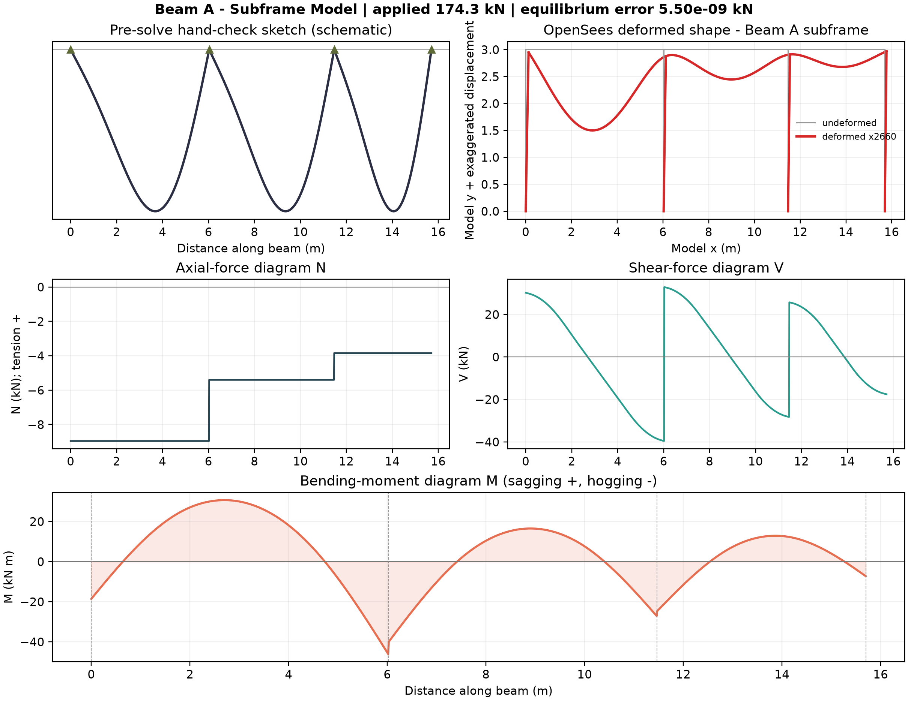
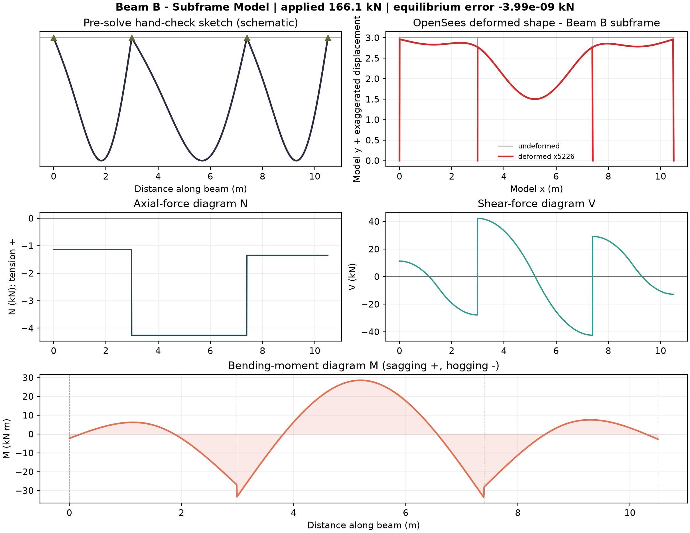
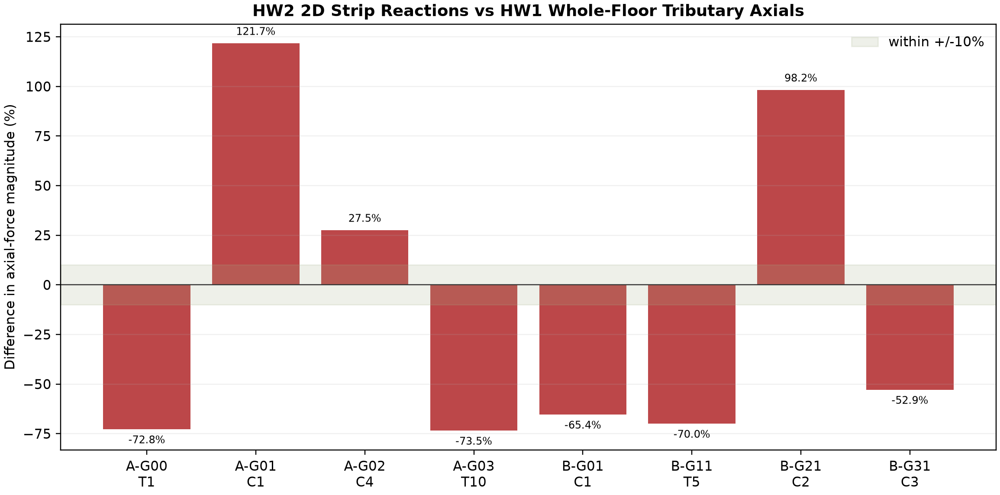

# Homework 2: From Slab to Beam - Tributary Areas, Line Loads and a Two-Dimensional Subframe

**Course:** Computer (& AI) Methods for Structural Engineering (DISC 5203)  
**Student:** Shuhan He / 何抒翰  
**Student ID:** 21345221  
**Assigned input:** Floor Plan 1 (student-ID final digit = 1)  
**Prepared for review:** 6 October 2026  
**Repository state:** extension of the existing HW1 Git working tree; not yet committed or uploaded

## 1. Executive summary

This report extends the accepted HW1 geometry rather than re-deriving it. The same **180.128 m²** net slab is read horizontally onto 24 finite beam segments. Equal distance to perpendicular beam edges produces the required 45-degree corner construction. The beam tributary areas close to the HW1 net slab area within numerical precision. Dead and live slab loads are stored separately as non-uniform line-load profiles, while the table reports an equivalent UDL by total load only.

Student ID 21345221 selects Floor Plan 1. The marked vertical member is **Beam A**, the left perimeter beam with slab primarily on one side. The marked horizontal member is **Beam B**, the continuous beam on the C1-C2-C3 line with slab on both sides. Four OpenSees analyses were completed: a standalone continuous beam and a one-floor beam-column subframe for each marked beam. All four close vertical equilibrium to less than 1e-8 kN and pass the pre-solve sign and magnitude checks.

The HW2 subframe-versus-HW1 axial comparison gives the same compression sign at every mapped support, but not a close magnitude match. This is reported as a diagnostic result, not hidden: the 2D marked strip contains only the load delivered to that beam line, whereas HW1 assigns the whole floor directly to its nearest column/wall, including orthogonal load paths and wall aggregation. Exact reconciliation would require a full 3D floor-grid model or a common support-aggregation rule.

## 2. Reused input, assumptions and marked beams



The HW1 local datum, slab outline, additions, openings, column locations and wall locations are reused unchanged from `config/plan1_geometry.json`. The new beam grid uses x = 0.20, 3.19, 7.60 and 10.70 m and y = 1.00, 7.03, 12.47 and 16.70 m. Segment endpoints are grid intersections; therefore reported spans are centreline distances.

Load and modelling assumptions:

- slab thickness `h = 0.150 m`;
- concrete unit weight `gamma = 25.0 kN/m³`;
- slab dead load `n_D = gamma h = 3.75 kN/m²`;
- live load `n_L = 5.00 kN/m²`;
- no superimposed finish is added because Floor Plan 1 gives none;
- beam self-weight is excluded so that both models compare the same slab-to-beam transfer requested by HW2;
- beam size is not printed on the plan, so both model types use an explicit common assumption of 300 x 600 mm;
- columns are 400 x 400 mm, storey height is 3.0 m, and `E = 30.0 GPa = 30.0e6 kN/m²`;
- service loads are unfactored. Units in OpenSees are kN and m, so second moments of area are in m4.

## 3. Beam tributary-area methodology

The net HW1 slab polygon is discretised into 0.02 m cells. For each cell centre, the shortest Euclidean distance to every finite beam segment is calculated. The cell is assigned to the closest segment, with a stable ID tie-break used only on zero-area theoretical boundaries. Between parallel beam lines the equal-distance locus is the mid-line. At the corner of perpendicular beam edges, `d_horizontal = d_vertical`, so `|Delta x| = |Delta y|` and the dividing line is exactly 45 degrees.

For an ideal rectangular two-way panel with short side `a` and long side `b`, the 45-degree construction gives each short edge a triangular area

`A_short = a²/4`,

and each long edge a trapezoidal area

`A_long = ab/2 - a²/4 = a(2b-a)/4`.

The method is applied to the actual net polygon rather than idealised full rectangles, so the stair/core openings remove load before assignment. P10 and P11 are one-edge cantilever balcony slabs; their constant projection adds a uniform component to the support-line load. A free edge is not treated as a support. This explicitly avoids the two assignment traps: beta-vx/beta-vy is not interchanged, and free edges are not entered into a four-edge table. The area route is the governing calculation here; any coefficient-table check must use the short span and the coefficient for the correct edge orientation.



Verification:

- beam count: **24**;
- sum of exact beam tributary areas: **180.128500 m²**;
- reused HW1 net slab area: **180.128500 m²**;
- global dead/live loads: **675.482 / 900.642 kN**.

## 4. Beam census

`Depth = 0.600 assumed` is deliberately labelled wherever the drawing gives no beam depth.

| ID | Start (m) | End (m) | Span (m) | Depth (m) | Bordering panel(s) | Class |
|---|---|---|---|---|---|---|
| H0-1 | (0.20,1.00) | (3.19,1.00) | 2.990 | 0.600 assumed | P1; P10 (cantilever balcony where overlapping) | two loaded sides locally (main slab + balcony) |
| H0-2 | (3.19,1.00) | (7.60,1.00) | 4.410 | 0.600 assumed | P2; P10 (cantilever balcony where overlapping) | two loaded sides locally (main slab + balcony) |
| H0-3 | (7.60,1.00) | (10.70,1.00) | 3.100 | 0.600 assumed | P3; P10 (cantilever balcony where overlapping) | two loaded sides locally (main slab + balcony) |
| H1-1 | (0.20,7.03) | (3.19,7.03) | 2.990 | 0.600 assumed | P1; P4 | interior, slab on both sides |
| H1-2 | (3.19,7.03) | (7.60,7.03) | 4.410 | 0.600 assumed | P2; P5 | interior, slab on both sides |
| H1-3 | (7.60,7.03) | (10.70,7.03) | 3.100 | 0.600 assumed | P3; P6 | interior, slab on both sides |
| H2-1 | (0.20,12.47) | (3.19,12.47) | 2.990 | 0.600 assumed | P4; P7 | interior, slab on both sides |
| H2-2 | (3.19,12.47) | (7.60,12.47) | 4.410 | 0.600 assumed | P5; P8 | interior, slab on both sides |
| H2-3 | (7.60,12.47) | (10.70,12.47) | 3.100 | 0.600 assumed | P6; P9 | interior, slab on both sides |
| H3-1 | (0.20,16.70) | (3.19,16.70) | 2.990 | 0.600 assumed | P7; P11 (cantilever balcony where overlapping) | two loaded sides locally (main slab + balcony) |
| H3-2 | (3.19,16.70) | (7.60,16.70) | 4.410 | 0.600 assumed | P8; P11 (cantilever balcony where overlapping) | two loaded sides locally (main slab + balcony) |
| H3-3 | (7.60,16.70) | (10.70,16.70) | 3.100 | 0.600 assumed | P9; P11 (cantilever balcony where overlapping) | two loaded sides locally (main slab + balcony) |
| V0-1 | (0.20,1.00) | (0.20,7.03) | 6.030 | 0.600 assumed | P1 | perimeter, slab on one side |
| V0-2 | (0.20,7.03) | (0.20,12.47) | 5.440 | 0.600 assumed | P4 | perimeter, slab on one side |
| V0-3 | (0.20,12.47) | (0.20,16.70) | 4.230 | 0.600 assumed | P7 | perimeter, slab on one side |
| V1-1 | (3.19,1.00) | (3.19,7.03) | 6.030 | 0.600 assumed | P1; P2 | interior, slab on both sides |
| V1-2 | (3.19,7.03) | (3.19,12.47) | 5.440 | 0.600 assumed | P4; P5 | interior, slab on both sides |
| V1-3 | (3.19,12.47) | (3.19,16.70) | 4.230 | 0.600 assumed | P7; P8 | interior, slab on both sides |
| V2-1 | (7.60,1.00) | (7.60,7.03) | 6.030 | 0.600 assumed | P2; P3 | interior, slab on both sides |
| V2-2 | (7.60,7.03) | (7.60,12.47) | 5.440 | 0.600 assumed | P5; P6 | interior, slab on both sides |
| V2-3 | (7.60,12.47) | (7.60,16.70) | 4.230 | 0.600 assumed | P8; P9 | interior, slab on both sides |
| V3-1 | (10.70,1.00) | (10.70,7.03) | 6.030 | 0.600 assumed | P3 | perimeter, slab on one side |
| V3-2 | (10.70,7.03) | (10.70,12.47) | 5.440 | 0.600 assumed | P6 | perimeter, slab on one side |
| V3-3 | (10.70,12.47) | (10.70,16.70) | 4.230 | 0.600 assumed | P9 | perimeter, slab on one side |

## 5. Line load on every beam

For beam segment `i`, the exact integrated loads are `D_i = n_D A_i` and `L_i = n_L A_i`. The equivalent UDL values in the table are

`w_D,eq = D_i/L_i,beam`, `w_L,eq = L_i/L_i,beam`, and `w_eq = w_D,eq + w_L,eq`.

This equivalence preserves **total load only**. It is not substituted for the local triangular/trapezoidal profile in the OpenSees models; the frozen profile is applied piecewise so local shear and moment shape are retained.

| ID | Span | Area | Mean width | Shape | Dead eq | Live eq | Total eq |
|---|---|---|---|---|---|---|---|
| H0-1 | 2.990 | 4.449 | 1.488 | two-way triangle/trapezoid + balcony cantilever UDL | 5.580 | 7.439 | 13.019 |
| H0-2 | 4.410 | 9.281 | 2.105 | two-way triangle/trapezoid + balcony cantilever UDL | 7.892 | 10.523 | 18.416 |
| H0-3 | 3.100 | 4.706 | 1.518 | two-way triangle/trapezoid + balcony cantilever UDL | 5.693 | 7.591 | 13.284 |
| H1-1 | 2.990 | 4.473 | 1.496 | two-sided superposed triangle/trapezoid | 5.610 | 7.480 | 13.089 |
| H1-2 | 4.410 | 9.707 | 2.201 | two-sided superposed triangle/trapezoid | 8.254 | 11.005 | 19.259 |
| H1-3 | 3.100 | 4.808 | 1.551 | two-sided superposed triangle/trapezoid | 5.816 | 7.755 | 13.571 |
| H2-1 | 2.990 | 4.473 | 1.496 | two-sided superposed triangle/trapezoid | 5.610 | 7.480 | 13.089 |
| H2-2 | 4.410 | 8.210 | 1.862 | two-sided superposed triangle/trapezoid | 6.981 | 9.308 | 16.289 |
| H2-3 | 3.100 | 4.808 | 1.551 | two-sided superposed triangle/trapezoid | 5.816 | 7.755 | 13.571 |
| H3-1 | 2.990 | 4.625 | 1.547 | two-way triangle/trapezoid + balcony cantilever UDL | 5.800 | 7.734 | 13.534 |
| H3-2 | 4.410 | 9.247 | 2.097 | two-way triangle/trapezoid + balcony cantilever UDL | 7.864 | 10.485 | 18.348 |
| H3-3 | 3.100 | 4.897 | 1.580 | two-way triangle/trapezoid + balcony cantilever UDL | 5.924 | 7.899 | 13.822 |
| V0-1 | 6.030 | 7.982 | 1.324 | one-sided triangle/trapezoid | 4.964 | 6.618 | 11.582 |
| V0-2 | 5.440 | 6.992 | 1.285 | one-sided triangle/trapezoid | 4.820 | 6.427 | 11.246 |
| V0-3 | 4.230 | 4.947 | 1.169 | one-sided triangle/trapezoid | 4.385 | 5.847 | 10.232 |
| V1-1 | 6.030 | 15.240 | 2.527 | two-sided superposed triangle/trapezoid | 9.478 | 12.637 | 22.114 |
| V1-2 | 5.440 | 8.980 | 1.651 | two-sided superposed triangle/trapezoid | 6.190 | 8.253 | 14.443 |
| V1-3 | 4.230 | 8.518 | 2.014 | two-sided superposed triangle/trapezoid | 7.551 | 10.068 | 17.619 |
| V2-1 | 6.030 | 15.383 | 2.551 | two-sided superposed triangle/trapezoid | 9.567 | 12.756 | 22.323 |
| V2-2 | 5.440 | 9.584 | 1.762 | two-sided superposed triangle/trapezoid | 6.607 | 8.809 | 15.416 |
| V2-3 | 4.230 | 8.652 | 2.045 | two-sided superposed triangle/trapezoid | 7.670 | 10.227 | 17.896 |
| V3-1 | 6.030 | 8.101 | 1.343 | one-sided triangle/trapezoid | 5.038 | 6.717 | 11.755 |
| V3-2 | 5.440 | 7.088 | 1.303 | one-sided triangle/trapezoid | 4.886 | 6.515 | 11.401 |
| V3-3 | 4.230 | 4.979 | 1.177 | one-sided triangle/trapezoid | 4.414 | 5.885 | 10.299 |

Units: span and mean width in m; area in m²; equivalent line loads in kN/m.



### 5.1 Worked example - H1-2 (central segment of Beam B)

H1-2 runs from (3.19,7.03) to (7.60,7.03), so `L = 4.410 m`. It borders P2 and P5 and is an interior, two-sided segment. The net 45-degree allocation, after removing the core opening, is `A_t = 9.707 m²`, giving

`D = 3.75 x 9.707 = 36.401 kN`,

`L_live = 5.00 x 9.707 = 48.535 kN`,

`w_D,eq = D/4.410 = 8.254 kN/m`,

`w_L,eq = L_live/4.410 = 11.005 kN/m`,

`w_total,eq = 19.259 kN/m`.

The plotted profile is the sum of the P2 and P5 triangular/trapezoidal contributions after the opening is removed. The equivalent UDL is used only as a total-load and hand-bound summary.



## 6. Pre-solve hand bounds and expected shapes

Before OpenSees was run, each span was bounded by `q_avg L²/8` for a simple span, with `q_avg L²/12` used as a fixed-end/continuous scale. The standalone and subframe beams were expected to show positive sagging at span centres, negative hogging over internal supports, zero or small end moments depending on support idealisation, and inflection points between the positive and negative regions. Beam B's middle span was expected to dominate because it is both the longest horizontal span and receives load from two sides.



The largest simple-span bounds are 52.643 kN m for Beam A and 46.819 kN m for Beam B. The solver peaks remain below 1.5 times these conservative order-of-magnitude bounds and have the expected signs.

## 7. OpenSees Model A - standalone continuous beams

The plain-language briefings are stored before the generated files in `briefings/beam_A.md` and `briefings/beam_B.md`. Each standalone model uses shared nodes through three spans, one horizontal restraint at the first support, vertical restraints at all supports, free rotations, elasticBeamColumn elements, and the frozen downward local-y piecewise line load. Sixty elements per grid segment reproduce the stored load profile without replacing it by the tabulated UDL.





## 8. OpenSees Model B - one-floor subframes

For each marked beam, the point supports are replaced by 3.0 m high 400 x 400 mm elastic columns with fixed bases. Beam and column elements share the same floor node, allowing finite support rotation and frame action. The same beam geometry, material, section and frozen load profile are retained, so differences from the standalone case are caused by support stiffness and continuity rather than changed loading.





The subframe curves remain smooth through the support nodes; there is no displacement kink caused by duplicate or disconnected nodes. The columns sway/rotate with the floor line as one connected frame. Small beam axial forces appear only in the subframe because column bending couples horizontal translation and joint rotation into the beam.

## 9. Numerical model results and comparison

| Beam | Model | Load | Max sagging | Max hogging | Max |M| | Max down (mm) | Largest qL2/8 | Verdict |
|---|---|---|---|---|---|---|---|---|
| A | pure | 174.305 | 40.243 | -49.039 | 49.039 | 0.7656 | 52.643 | PASS |
| A | subframe | 174.305 | 30.678 | -46.096 | 46.096 | 0.5640 | 52.643 | PASS |
| B | pure | 166.139 | 29.470 | -33.191 | 33.191 | 0.2562 | 46.819 | PASS |
| B | subframe | 166.139 | 28.566 | -33.604 | 33.604 | 0.2870 | 46.819 | PASS |

Units: load in kN; moments in kN m.

For Beam A, finite column stiffness reduces the maximum absolute moment from 48.908 to 44.206 kN m and the maximum downward deflection from 0.759 to 0.558 mm. The subframe introduces beam axial compression and non-zero end moments because the column joints are neither perfect pins nor ideal vertical rollers. For Beam B, both models retain almost the same peak hogging magnitude (about 33 kN m), but the subframe develops end moment and axial compression and slightly redistributes the sagging peak. The small deflections follow from the assumed uncracked 300 x 600 mm elastic section; they should not be read as cracked-service deflections.

The **subframe is the more defensible model for beam design actions** because it represents finite column stiffness and joint continuity. The standalone beam is still valuable as an independent bound and debugging model. It answers a deliberately simplified support question rather than the full frame-interaction question.

## 10. Subframe support reactions and HW1 axial cross-check

Compression is reported as negative in both columns. Percentage difference is `(abs(N_HW2)-abs(N_HW1))/abs(N_HW1) x 100%`.

| Strip | Grid | HW1 element | HW1 N | HW2 N | Difference % | Sign |
|---|---|---|---|---|---|---|
| A | G00 | T1 | -111.266 | -30.239 | -72.8 | PASS |
| A | G01 | C1 | -32.699 | -72.509 | 121.7 | PASS |
| A | G02 | C4 | -42.360 | -53.999 | 27.5 | PASS |
| A | G03 | T10 | -66.258 | -17.559 | -73.5 | PASS |
| B | G01 | C1 | -32.699 | -11.302 | -65.4 | PASS |
| B | G11 | T5 | -233.992 | -70.151 | -70.0 | PASS |
| B | G21 | C2 | -36.226 | -71.814 | 98.2 | PASS |
| B | G31 | C3 | -27.321 | -12.872 | -52.9 | PASS |



All eight comparisons have the correct compression sign and the same order of magnitude, but none is within a few percent; therefore this is **not claimed as a close-match positive result**. The dominant reason is model scope. HW1 directly assigns each entire slab cell to its nearest vertical element, including orthogonal load paths and walls represented as aggregated finite segments. Each HW2 model is only one marked 2D strip and applies load to that beam line; it cannot contain all perpendicular beams delivering load to the same column/wall. Some grid points also map to wall junctions rather than one-to-one columns. No load was tuned to improve the comparison.

For the marked beam's own design actions, the HW2 subframe is trusted because it follows the explicit slab-to-beam-to-column path with frame stiffness. HW1 remains the independent whole-floor gravity estimate. A required exact reconciliation should be performed with a 3D floor grid or a common nodal aggregation model; the present discrepancy is retained as a transparent limitation and a useful diagnostic.

## 11. Speech-to-model prompt and iteration record

The agent was given two short structural briefings in words, not scripts. Each states the marked beam path, spans, supports, frozen loads, section, material and required outputs. The agent then transcribed those briefings into:

- `models/beam_A_pure.py` and `models/beam_A_subframe.py`;
- `models/beam_B_pure.py` and `models/beam_B_subframe.py`;
- shared audited implementation in `models/common.py`.

The iteration gates were:

1. confirm Floor Plan 1 and identify Beam A/Beam B from the red boxes;
2. freeze the HW1 slab, 45-degree tributary assignments and dead/live profiles;
3. transcribe the standalone beams and verify units, sign and qL² bounds;
4. replace support restraints with fixed-base 3 m columns, retaining identical loads;
5. verify reaction equilibrium, N/V/M signs, deformed-shape continuity and the HW1 axial comparison;
6. leave Git commit/upload pending student inspection and sign-off.

The full wording and revision trail are preserved in `briefings/beam_A.md`, `briefings/beam_B.md` and `briefings/iteration_log.md`.

## 12. Reproducibility, verification and limitations

Run from the repository root:

```powershell
python scripts/analyze_hw2_beam_loads.py
python scripts/run_hw2_models.py
python scripts/summarize_hw2_models.py
python scripts/build_hw2_report.py
python scripts/render_hw2_report_pdf.py
python scripts/verify_hw2_outputs.py
```

Key deterministic checks are exact beam-area closure, global dead/live load conservation, four OpenSees reaction/load closures, expected sagging/hogging signs, pre-solve bound compliance and existence of every deliverable. The method generalises because a different floor plan changes the slab polygon, beam segments and openings in configuration rather than the load-transfer algorithm.

Limitations are explicit: the source plan is raster; unprinted beam dimensions are assumptions; linear uncracked elastic sections do not represent cracked stiffness; the 2D subframes omit orthogonal frame members; and literal handwritten student sketches/signature must be added if the instructor requires physical handwriting rather than the preserved pre-solve schematic. The numerical work and report are complete for review, but the human acceptance gate remains pending until the student approves the repository state.

## 13. Deliverable index

- report: `report/21345221_HW2_report.md` and `output/pdf/21345221_HW2_report.pdf`;
- beam census and line-load table: `output/results/hw2_beam_line_loads.csv`;
- frozen profiles: `output/results/hw2_beam_profiles.json`;
- four OpenSees inputs: `models/beam_A_pure.py`, `models/beam_A_subframe.py`, `models/beam_B_pure.py`, `models/beam_B_subframe.py`;
- reactions, model summaries and cross-check tables: `output/results/hw2_support_reactions.csv`, `hw2_model_summary.csv`, `hw2_axial_crosscheck.csv`;
- response diagrams and verification figures: `output/figures/hw2_*.png`;
- prompt record: `briefings/`;
- configuration and reusable procedures: `config/hw2_beams.json`, `CLAUDE.md`, `skills.md`.
