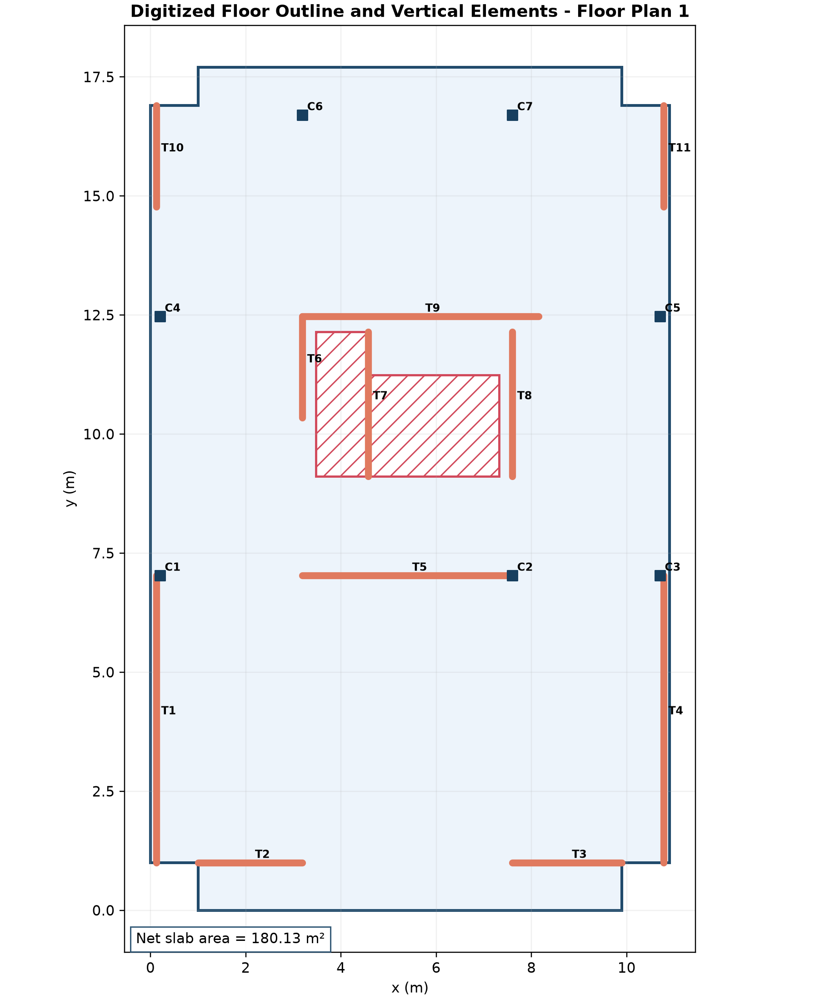
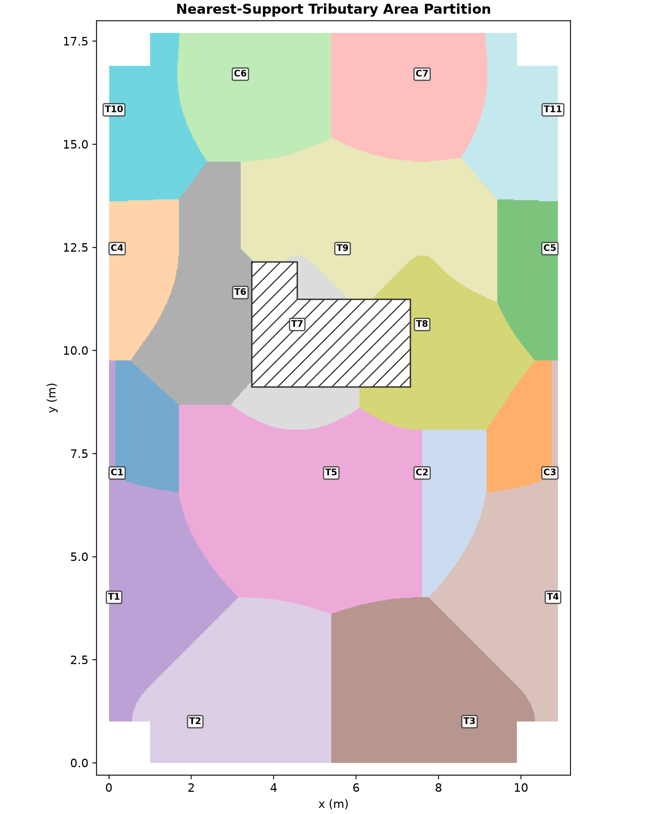
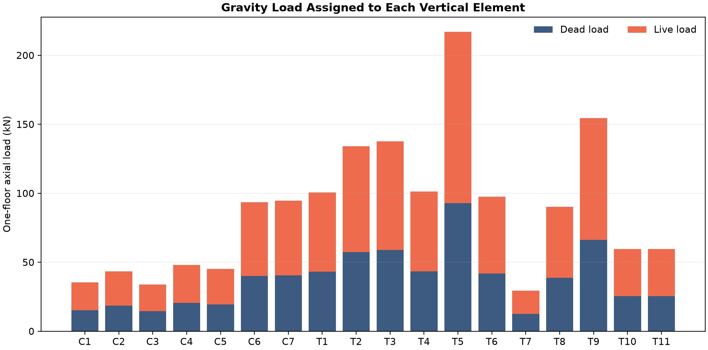

# Homework 1: AI-Assisted Structural Analysis of a Building Floor Plan

**Course:** Computer (& AI) Methods for Structural Engineering (DISC 5203)  
**Student:** Shuhan He  
**Student ID:** 21345221  
**Assigned input:** Floor Plan 1 (ID final digit = 1)  
**Date:** 19 September 2026

## 1. Executive summary

This report presents a reproducible extraction and gravity-load analysis of Floor Plan 1. The net slab area is **180.13 m²** after excluding **9.20 m²** of stair/core openings. Seven columns and eleven shear-wall elements were identified. A nearest-support partition, equivalent to a generalized Voronoi construction for both points and line segments, assigns every slab cell to exactly one vertical element. The one-floor gravity load is **1576.1 kN** and the five-storey base total is **7880.6 kN**.

## 2. Input and interpretation

The assignment PDF and `assets/FloorPlan1.png` were inspected visually. The printed dimensions were used to establish a metric coordinate system rather than inferring scale from image pixels. The origin is the lower-left principal wall-centreline intersection, with +x to the right and +y upward. Geometry is stored independently in `config/plan1_geometry.json` so that every interpreted coordinate can be reviewed or changed without editing the solver.

The source is a structural floor-plan diagram rather than a machine-readable CAD model. Dimensions that are explicit in the image govern; where a wall endpoint or opening extent is visually indicated but not fully dimensioned, its centreline was digitized from adjacent dimension chains. These assumptions affect the local partition but do not change the global load equilibrium.


## 3. Extracted geometry and vertical elements

The slab model consists of the principal rectangular floor, the top and bottom balcony slabs, and two excluded core/stair openings. Columns are point supports at their centre coordinates. Walls are finite centreline segments, so their distance field reflects both length and orientation.



Key area values:

- Gross modeled slab envelope: **189.33 m²**
- Excluded openings: **9.20 m²**
- Net loaded floor area: **180.13 m²**
- Floor-to-floor height: **3.0 m** (assignment input; not required for gravity-load magnitude)
- Number of identical storeys: **5**

## 4. Tributary-area method

The net slab is discretized into 0.02 m square cells. For each cell centre, the script calculates Euclidean distance to each column centre and the shortest perpendicular/end distance to each finite wall centreline. The cell is assigned to the closest support. This constructs midpoint boundaries automatically; at corners, equal-distance loci form the required 45-degree transitions. Exact numerical ties are resolved in stable ID order.

For a point **p** and wall segment from **a** to **b**, the distance is

`t = clamp(((p-a)·(b-a)) / ||b-a||², 0, 1)` and `d = ||p - (a + t(b-a))||`.

The raster areas are normalized by the ratio of exact polygon area to counted cell area. This correction is only for boundary-cell discretization and preserves relative tributary shares. The pre-normalization area closure error is **0.0270%**.



## 5. Load calculation

Only loads specified by the assignment are applied. Concrete slab self-weight is treated as dead load; beams, columns, walls, finishes, facade and partitions are excluded because their densities or weights were not supplied.

- Slab thickness `h = 0.150 m`
- Reinforced-concrete unit weight `γ = 25.0 kN/m³`
- Dead area load `q_D = γh = 3.75 kN/m²`
- Live area load `q_L = 5.00 kN/m²`
- Total area load `q = q_D + q_L = 8.75 kN/m²`

For vertical element *i* with tributary area `A_i`:

`D_i = q_D A_i`, `L_i = q_L A_i`, `N_i,1 = D_i + L_i`, and `N_i,base = 5 N_i,1`.

The five-storey multiplier assumes identical aligned supports and identical gravity loading on all levels. Values are unfactored service loads, not ultimate design actions.

## 6. Results by vertical element

Coordinates are support points for columns and wall-segment midpoints for walls. `Base total` is the cumulative unfactored axial load at the base of a five-storey stack.

| ID | Type | Location (m) | Size (mm) | Area (m²) | Dead (kN) | Live (kN) | 1-floor total (kN) | Base total (kN) |
|---|---|---|---|---|---|---|---|---|
| C1 | Column | (0.20, 7.03) | 400x400 | 4.05 | 15.2 | 20.3 | 35.4 | 177.2 |
| C2 | Column | (7.60, 7.03) | 400x400 | 4.98 | 18.7 | 24.9 | 43.5 | 217.7 |
| C3 | Column | (10.70, 7.03) | 400x400 | 3.87 | 14.5 | 19.3 | 33.8 | 169.2 |
| C4 | Column | (0.20, 12.47) | 400x400 | 5.49 | 20.6 | 27.4 | 48.0 | 240.0 |
| C5 | Column | (10.70, 12.47) | 400x400 | 5.17 | 19.4 | 25.8 | 45.2 | 226.1 |
| C6 | Column | (3.19, 16.70) | 400x400 | 10.69 | 40.1 | 53.5 | 93.6 | 467.8 |
| C7 | Column | (7.60, 16.70) | 400x400 | 10.82 | 40.6 | 54.1 | 94.7 | 473.5 |
| T1 | Wall | (0.12, 4.01) | 250x2000 | 11.50 | 43.1 | 57.5 | 100.6 | 503.2 |
| T2 | Wall | (2.10, 1.00) | 250x2000 | 15.32 | 57.4 | 76.6 | 134.0 | 670.2 |
| T3 | Wall | (8.75, 1.00) | 250x2000 | 15.73 | 59.0 | 78.6 | 137.6 | 688.0 |
| T4 | Wall | (10.78, 4.01) | 250x2000 | 11.59 | 43.5 | 58.0 | 101.4 | 507.1 |
| T5 | Wall | (5.39, 7.03) | 250x2600 | 24.80 | 93.0 | 124.0 | 217.0 | 1084.9 |
| T6 | Wall | (3.19, 11.40) | 250x2000 | 11.16 | 41.8 | 55.8 | 97.6 | 488.2 |
| T7 | Wall | (4.57, 10.63) | 250x2850 | 3.36 | 12.6 | 16.8 | 29.4 | 147.1 |
| T8 | Wall | (7.60, 10.63) | 250x2850 | 10.31 | 38.7 | 51.6 | 90.3 | 451.3 |
| T9 | Wall | (5.67, 12.47) | 250x4500 | 17.66 | 66.2 | 88.3 | 154.5 | 772.5 |
| T10 | Wall | (0.12, 15.84) | 250x2000 | 6.82 | 25.6 | 34.1 | 59.7 | 298.3 |
| T11 | Wall | (10.78, 15.84) | 250x2000 | 6.82 | 25.6 | 34.1 | 59.7 | 298.3 |



## 7. Building-level load accumulation

| Level | Floors supported | Dead (kN) | Live (kN) | Total (kN) |
|---|---|---|---|---|
| Roof/F5 | 1 | 675.482 | 900.642 | 1576.124 |
| F4 | 2 | 1350.964 | 1801.285 | 3152.249 |
| F3 | 3 | 2026.446 | 2701.927 | 4728.373 |
| F2 | 4 | 2701.927 | 3602.570 | 6304.497 |
| F1/Base | 5 | 3377.409 | 4503.212 | 7880.622 |

## 8. Verification checks

1. **Area closure:** `ΣA_i = 180.128500 m²`; independent net polygon area = `180.128500 m²`; difference = `0.000e+00 m²`.
2. **Dead-load conservation:** element sum = `675.482 kN`; global calculation = `675.482 kN`.
3. **Live-load conservation:** element sum = `900.643 kN`; global calculation = `900.642 kN`.
4. **Unit check:** `(m²)(kN/m²) = kN` for each axial-load result.
5. **Positivity and coverage:** all 18 elements receive a positive tributary area, and every in-slab cell is assigned exactly once.

## 9. Limitations and defensibility

- The drawing is a raster image, so some wall endpoints and opening limits require engineering interpretation. The digitized JSON makes those judgments auditable.
- Nearest-distance partition is a geometric gravity-load idealization. A detailed slab analysis could redistribute load because of stiffness, span direction, openings and discontinuities.
- Support self-weight and non-slab dead loads are intentionally excluded. Adding them requires explicit material and section data.
- The algorithm generalizes to irregular outlines, holes, point columns and finite wall axes. A new input can be analyzed by replacing only the geometry configuration.

## 10. Reproducibility and AI-agent workflow

The agent inspected the assignment PDF and all supplied images, translated visible dimensions into a reviewable geometry configuration, implemented the partition and load workflow, generated plots and tables, and ran deterministic verification checks. The Git repository includes source inputs, scripts, configuration, guidance (`CLAUDE.md`, `skills.md`), a pre-commit verification hook, intermediate geometry, results and this report.

To reproduce from the repository root:

```powershell
python -m pip install -r requirements.txt
python scripts/analyze_floor_plan.py
python scripts/build_report.py
python scripts/render_report_pdf.py
python scripts/verify_outputs.py
```

## 11. Files produced

- `config/plan1_geometry.json`: independently reviewable interpretation of the drawing
- `scripts/analyze_floor_plan.py`: geometry, partition, loads and plots
- `scripts/build_report.py`: deterministic Markdown report assembly
- `scripts/render_report_pdf.py`: PDF convenience export
- `scripts/verify_outputs.py`: automated numerical and artifact checks
- `output/results/*.csv`: element and level results
- `output/intermediate/geometry_plan1.json`: extracted geometry and area audit
- `output/figures/*.png`: geometry, tributary and load diagrams
